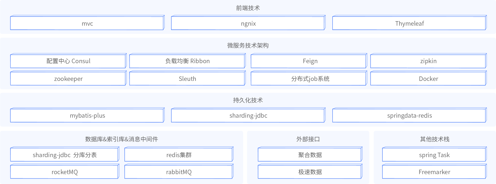
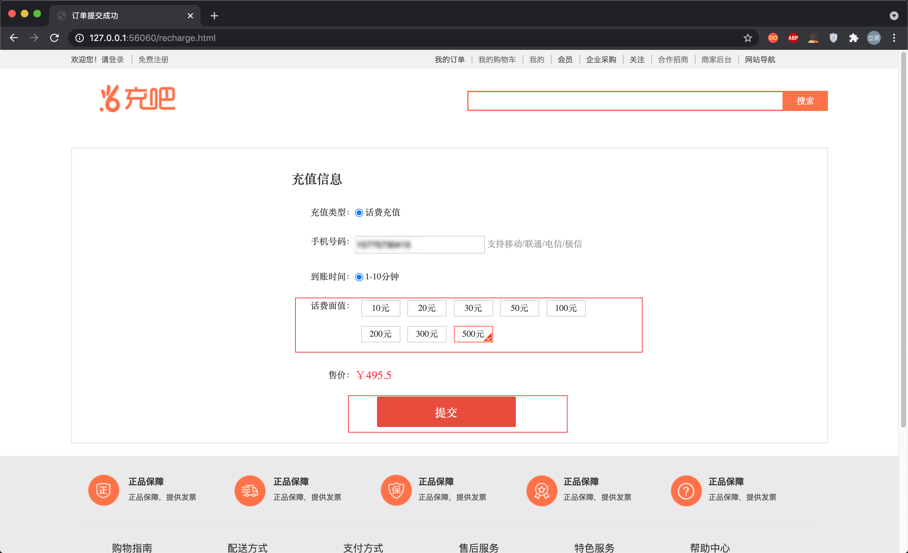
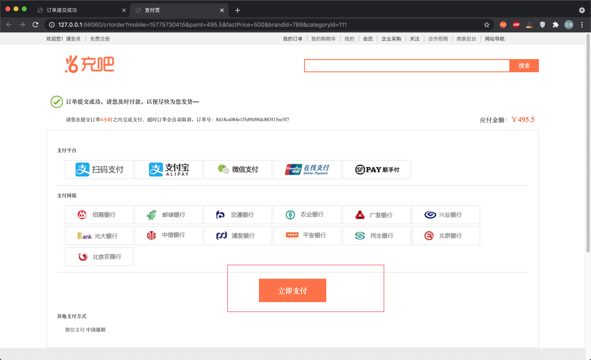
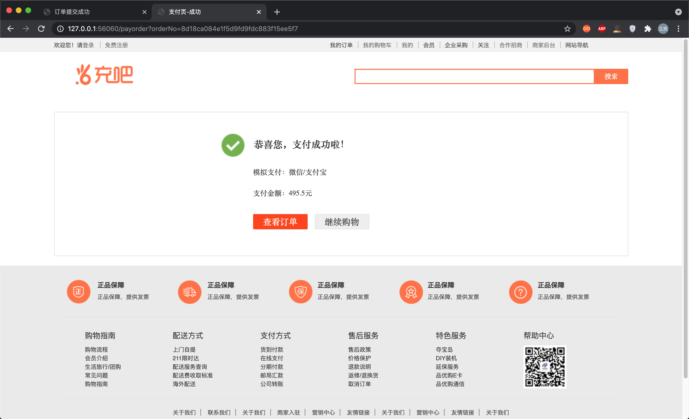
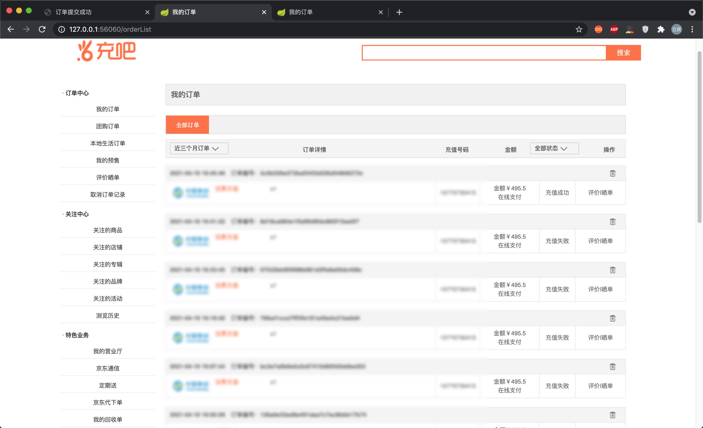

## 虚拟电商


### 什么是虚拟电商

所谓虚拟电商, 跟传统电商最大的特点就是没有实体物流配送, 像充话费, 充流量. 比如对于传统电商而言买个笔记本电脑, 支付完成后, 后台需要走物流配送流程, 而话费充值完后呢, 不需要物流配送, 需要和第三方接口(例如中国移动)对接, 第三方充值成功或者失败后需要回调异步通知, 这类业务还包括加油卡, 礼品卡, 游戏充值等, 统称电商虚拟交易, 电商虚拟交易项目有一定业务价值和技术价值, 也是对传统电商业务补充.

### 电商业务技术特点

商业上: 需要业务人员提前和第三方签订合作协议, 供应商的差额是虚拟业务的赢利点所在.

技术上: 虚拟业务最大技术特点和对接过程中由于网络, 双方系统各种问题, 会有延迟, 重试, 及最后订单同步成功失败等一系列问题.

### 第三方对接平台

- 聚合平台对接: https://www.juhe.cn/docs/api/id/85
- 极速数据平台对接: https://www.jisuapi.com/

## 项目介绍

### 基本概述

充吧是基于电商平台延伸的虚拟电商业务平台, 作为常见的电商业务之一, 用户可在平台中完成话费充值, 游戏点卡充值等业务, 相比于传统的电商业务, 虚拟业务无需物流配送, 为用户提供更加完善的电商体验.

充吧项目中深挖redis使用场景, 实现自定义延迟队列, 高可用方面实现自定义分布式job系统, 引入mybaits-plus, sharding-jdbc, 支持分库分表, 深度剖析 sharding-jdbc 分片源码, 对sharding-jdbc分库分表策略进行扩展.

延迟队列中对线程和线程池技术深入应用, 并结合logback自定义相关监控. 基于freemarker模板sql脚本批量生成, 用于批量生成分库分表.

Sleuth + Zipkin + mysql+ RabbitMQ 链路追踪存储相关问题解决(可使用Skywalking非常棒), 解决了分布式系统的链路追踪优化问题.

### 项目优势

- mock两个供应商(实际供应商对接需要商务合作, 交付押金等一系列问题)
- 失败轮转(例如余额不足).
- 网络故障重试.
- 充值失败重试(阈值问题).
- 回调异常, 订单状态同步相关问题.

## 架构图

### 功能架构


### 系统架构



## 预览

### 充值







### 订单显示



### 后台服务


## 启动手册

### 环境配置

- 开发工具
  - Maven 3.6
  - IDEA 2020.1
  - MacBookPro 2015 16 GB 256 GB
  - Git
- 环境搭建 
  - 阅读`resource`下的`PATH.md`文件

### 配置中心搭建

需要在`Github`或者是`Gitee`上面一个新的仓库, 比如`recharge-config`, 创建完成之后将`resource/config`下的全部`.yml`文件上传到远程仓库中.

完成之后在`config`工程中的`application.yml`修改关于远程仓库的配置.

### 数据库文件生成

进入`recharge-schedule-service`模块中根据需求修改`GenerateSqlUtils`.

```java
// 数据库个数
sqlbean.setDbCount(2);
// 表个数
sqlbean.setTaskInfoCount(2);
// 日期后缀
List<String> monthList = getMonthBetween("2021_4", "2021_5");
```

修改完成之后启动`GenerateSqlUtils`.
